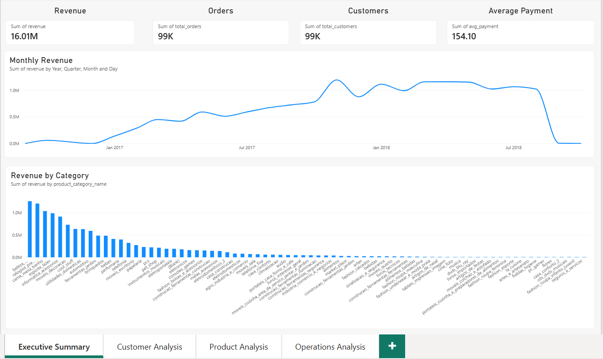
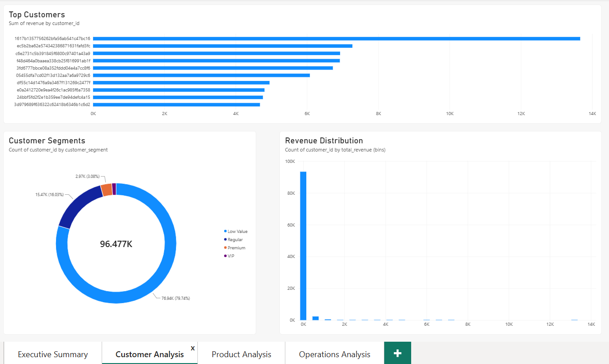
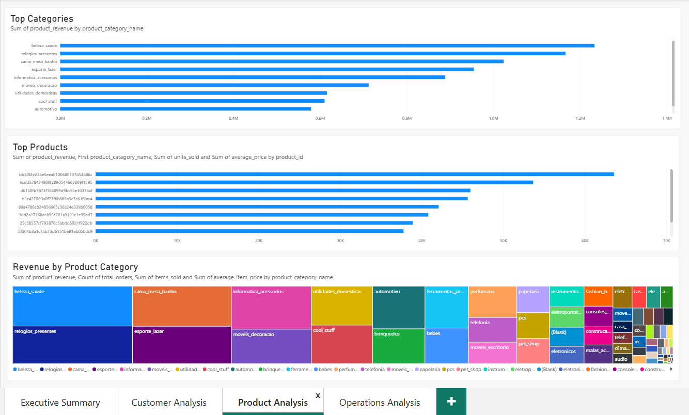
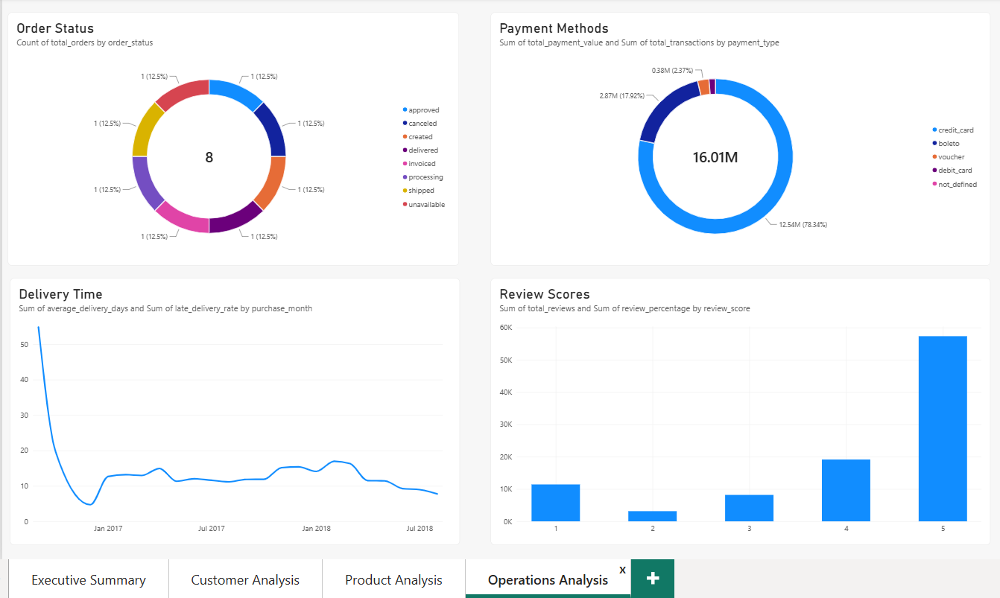

# Ecommerce Full-Stack Analytics

**End-to-End E-Commerce Analytics Project using PostgreSQL, SQL, Python and Power BI**

---

## Project Overview

This project is an end-to-end e-commerce analytics solution built using the **Brazilian E-Commerce Public Dataset by Olist**.

The project demonstrates the complete analytics workflow from raw transactional data to business insights:

```text
Raw E-Commerce Data
        ↓
PostgreSQL Database
        ↓
SQL Data Analysis & Transformation
        ↓
Analytical SQL Views
        ↓
Python Exploratory Data Analysis
        ↓
Power BI Dashboard
        ↓
Business Insights & Recommendations
```

The purpose of this project is to demonstrate practical, job-ready skills in:

* SQL
* PostgreSQL
* Database analysis
* Data cleaning and validation
* Business analytics
* Customer analytics
* Product analytics
* Operational analytics
* Python
* Exploratory Data Analysis
* Data visualization
* Power BI
* Query optimization
* Business reporting
* Git/GitHub

---

# Business Objective

The objective of this project is to analyze e-commerce performance and provide actionable insights that can support business decisions.

The analysis investigates questions such as:

* How is overall e-commerce performance?
* How much revenue is generated?
* How many orders and customers are there?
* How does revenue change over time?
* Which customers generate the most revenue?
* How can customers be segmented?
* Which product categories perform best?
* Which products generate the most revenue?
* Which payment methods are most commonly used?
* How long does delivery take?
* What percentage of orders are delivered late?
* How satisfied are customers?
* Is there an observable relationship between delivery performance and customer reviews?

---

# Technology Stack

| Technology           | Purpose                                               |
| -------------------- | ----------------------------------------------------- |
| **PostgreSQL**       | Relational database                                   |
| **pgAdmin 4**        | Database management                                   |
| **SQL**              | Data extraction, transformation and business analysis |
| **Python**           | Exploratory data analysis and visualization           |
| **Pandas**           | Data manipulation                                     |
| **NumPy**            | Numerical analysis                                    |
| **Matplotlib**       | Data visualization                                    |
| **Seaborn**          | Statistical visualization                             |
| **Jupyter Notebook** | Python analysis environment                           |
| **Power BI**         | Interactive business intelligence dashboard           |
| **Git**              | Version control                                       |
| **GitHub**           | Project repository and portfolio                      |

---

# Dataset

This project uses the:

**Brazilian E-Commerce Public Dataset by Olist**

The dataset contains approximately 100,000 e-commerce orders and information related to:

* Customers
* Orders
* Order items
* Products
* Payments
* Reviews
* Sellers
* Geographic information

### Dataset Source

[Kaggle — Brazilian E-Commerce Public Dataset by Olist](https://www.kaggle.com/datasets/olistbr/brazilian-ecommerce)

The raw CSV files are not included in this repository.

Please review the dataset's current licensing and usage terms before redistributing the original data.

---

# Database Architecture

The project uses PostgreSQL as the primary analytical database.

The main relational structure is:

```text
customers
    │
    └──────── orders
                  │
                  ├──────── order_items ─────── products
                  │
                  ├──────── payments
                  │
                  └──────── reviews
```

### Key relationships

```text
customers.customer_id
        ↓
orders.customer_id

orders.order_id
        ↓
order_items.order_id

products.product_id
        ↓
order_items.product_id

orders.order_id
        ↓
payments.order_id

orders.order_id
        ↓
reviews.order_id
```

This relational structure allows customer, order, product, payment, delivery and review information to be analyzed together.

---

# Repository Structure

```text
Ecommerce-Full-Stack-Analytics/
│
├── data/
│   └── README.md
│
├── sql/
│   ├── 01_create_tables.sql
│   ├── 02_import_data.sql
│   ├── 03_business_analysis.sql
│   ├── 04_customer_segmentation.sql
│   ├── 05_views.sql
│   ├── 06_indexes.sql
│   └── 07_dashboard_queries.sql
│
├── powerbi/
│   └── Ecommerce_Dashboard.pbix
│
├── reports/
│   ├── advanced_sql_findings.md
|   ├── sql_business_report.md
│
├── notebooks/
│   └── ecommerce_python_analysis.ipynb
│
├── images/
│   ├── executive_summary.png
│   ├── customer_analysis.png
│   ├── product_analysis.png
│   └── operations_analysis.png
│
├── README.md
│
├── requirements.txt
│
└── .gitignore
```

---

# SQL Analysis

The SQL layer contains the core business analysis performed in PostgreSQL.

## SQL Topics Covered

### Fundamental SQL

* SELECT
* WHERE
* GROUP BY
* HAVING
* ORDER BY
* DISTINCT
* CASE statements

### Aggregations

* COUNT
* SUM
* AVG
* MIN
* MAX
* ROUND

### Joins

* INNER JOIN
* Multi-table joins
* Relational data analysis

### Advanced SQL

* Common Table Expressions
* Window functions
* `LAG()`
* Ranking
* Conditional aggregation
* Date/time analysis
* Customer segmentation
* Analytical views

---

# Customer Analytics

Customer analysis focuses on identifying valuable customers and understanding customer behavior.

The analysis includes:

* Customer revenue
* Number of orders
* Average order value
* First purchase
* Last purchase
* Customer segmentation
* RFM-style analysis
* Customer lifetime value

### Customer Segmentation

Customers are classified into analytical segments such as:

```text
VIP
Premium
Regular
Low Value
```

These categories are analytical assumptions created for this portfolio project rather than official Olist classifications.

---

# Product Analytics

Product analysis investigates:

* Product revenue
* Units sold
* Product categories
* Average product price
* Top-performing products
* Top-performing categories

This analysis helps identify products and categories that contribute significantly to sales performance.

---

# Operations Analytics

Operational analysis focuses on:

* Order status
* Delivery time
* Estimated delivery dates
* Late deliveries
* Late delivery rate
* Payment methods
* Customer reviews

Delivery performance is analyzed to understand potential relationships between operational performance and customer satisfaction.

---

# Customer Satisfaction

Customer review data is analyzed to understand:

* Review score distribution
* Average review score
* Review performance
* Delivery status versus review score

Observed relationships are treated as associations rather than proof of causality.

---

# SQL Query Optimization

The project also demonstrates database performance concepts.

Indexes are created on frequently queried columns to improve query performance.

PostgreSQL's:

```sql
EXPLAIN
```

command is used to inspect query execution plans.

This demonstrates an understanding of both:

> writing SQL queries

and

> considering how those queries are executed by the database.

---

# Python Exploratory Data Analysis

Python provides a complementary analytical layer to the SQL analysis.

The Jupyter notebook:

```text
notebooks/ecommerce_python_analysis.ipynb
```

contains:

* PostgreSQL data connection
* Data loading
* Dataset inspection
* Data quality checks
* Missing-value analysis
* Order-status analysis
* Revenue analysis
* Monthly revenue trends
* Customer analysis
* Product category analysis
* Delivery analysis
* Review analysis
* Business-oriented visualizations
* Executive KPI summary
* Business insights

### Main Python Libraries

```text
Pandas
NumPy
Matplotlib
Seaborn
SQLAlchemy
Psycopg2
Plotly
```

---

# Power BI Dashboard

Power BI is connected to PostgreSQL analytical views.

The dashboard is designed around business questions rather than simply displaying raw data.

## Dashboard Pages

### Page 1 — Executive Summary

Provides a high-level overview of business performance.

Key metrics include:

* Total Revenue
* Total Orders
* Total Customers
* Average Order Value
* Monthly Revenue
* Revenue Trends

### Page 2 — Customer Analysis

Includes:

* Top Customers
* Customer Segments
* Customer Revenue
* Revenue Distribution
* Customer Value

### Page 3 — Product Analysis

Includes:

* Top Product Categories
* Top Products
* Product Revenue
* Units Sold
* Average Product Price

### Page 4 — Operations Analysis

Includes:

* Order Status
* Average Delivery Time
* Late Delivery Rate
* Payment Methods
* Review Scores

---

# Dashboard Preview

## Executive Summary



## Customer Analysis



## Product Analysis



## Operations Analysis



---

# Analytical Views

The PostgreSQL database contains reusable analytical views designed to support reporting and Power BI.

Examples include:

```text
vw_customer_summary
vw_customer_segments
vw_category_performance
vw_product_performance
vw_order_status
vw_delivery_performance
vw_payment_methods
vw_review_scores
vw_delivery_review_analysis
```

These views provide business-ready datasets that can be consumed by reporting tools.

---

# Business Questions Answered

The project investigates the following business questions:

### Revenue

* What is the total revenue?
* How does revenue change over time?
* What is the average order value?

### Customers

* Who are the highest-value customers?
* How many orders does each customer make?
* How can customers be segmented?
* How is revenue distributed across customers?

### Products

* Which categories generate the most revenue?
* Which products sell the most?
* Which products contribute most to revenue?

### Operations

* What is the order-status distribution?
* What is the average delivery time?
* What percentage of orders are delivered late?

### Customer Experience

* What is the distribution of review scores?
* What is the average review score?
* Do late and on-time deliveries have different average review scores?

---

# Business Insights

The analysis is designed to support decisions related to:

* Customer retention
* Customer segmentation
* Product portfolio management
* Revenue growth
* Operational improvement
* Delivery performance
* Customer experience
* Marketing prioritization

The final numerical findings and recommendations are documented in the project reports.

---

# Reports

Business findings and analytical conclusions are available in:

```text
reports/
├── advanced_sql_findings.md
├── sql_business_report.md
```

The reports translate technical analysis into business-oriented findings and recommendations.

---

# Reproducibility

A new user can reproduce the analytical workflow by:

1. Downloading the Olist dataset.
2. Installing PostgreSQL and pgAdmin 4.
3. Creating a PostgreSQL database.
4. Creating the required tables using `01_create_tables.sql`.
5. Importing the dataset.
6. Running the validation queries.
7. Running the business analysis scripts.
8. Creating the analytical views.
9. Creating database indexes.
10. Connecting Power BI to PostgreSQL.
11. Opening the Python notebook and connecting it to PostgreSQL.

---

# Important Metric Definitions

Different tables contain different monetary measures.

### Payment value

```text
payments.payment_value
```

is used for payment-based revenue analysis.

### Product price

```text
order_items.price
```

is used for product and category sales analysis.

### Freight

```text
order_items.freight_value
```

represents freight/shipping value.

These metrics are not automatically interchangeable and are treated separately depending on the business question.

---

# Project Limitations

### Historical Dataset

The dataset represents historical e-commerce activity and may not reflect current market conditions.

### Customer Segmentation

Customer segmentation thresholds are analytical assumptions created for this project.

### Revenue Definitions

Revenue calculations depend on the business definition and source table being analyzed.

### Causality

Observed relationships between variables should not automatically be interpreted as causal relationships.

---

# Future Improvements

Future phases of the project may include:

* Advanced RFM scoring
* Cohort analysis
* Customer retention analysis
* Funnel analysis
* Advanced customer lifetime value analysis
* Statistical analysis
* Advanced Power BI measures
* Additional business KPIs
* Automated reporting
* Advanced Python analytics
* End-to-end analytical pipelines

---

# Project Status

## Phase 1 — Complete 

The following components have been completed:

* PostgreSQL database
* SQL data analysis
* Advanced SQL
* Customer segmentation
* Analytical SQL views
* Query optimization
* Python exploratory analysis
* Power BI dashboard
* Business reports
* Portfolio documentation

---

# Skills Demonstrated

This project demonstrates practical experience with:

**Data Analytics**

* Exploratory Data Analysis
* Business analysis
* KPI development
* Customer analytics
* Product analytics
* Operational analytics

**SQL & Databases**

* PostgreSQL
* SQL joins
* Aggregations
* CTEs
* Window functions
* SQL views
* Database indexes
* Query execution plans

**Python**

* Pandas
* NumPy
* Matplotlib
* Seaborn
* Jupyter Notebook
* PostgreSQL connectivity

**Business Intelligence**

* Power BI
* Dashboard development
* KPI visualization
* Business reporting
* Data storytelling

**Development**

* Git
* GitHub
* Project documentation
* Reproducible analytics

---

# Project Workflow

```text
                 BUSINESS QUESTIONS
                        ↓
                  RAW DATA
                        ↓
                 POSTGRESQL
                        ↓
              DATA VALIDATION
                        ↓
                  SQL ANALYSIS
                        ↓
              ANALYTICAL VIEWS
                   ↙         ↘
              PYTHON        POWER BI
                ↓              ↓
              EDA          DASHBOARD
                   ↘         ↙
                 BUSINESS INSIGHTS
                        ↓
                 RECOMMENDATIONS
```

---

# Disclaimer

This project was created for educational and portfolio purposes using publicly available e-commerce data.

The analysis, customer segmentation methodology and business recommendations are created specifically for this portfolio project and do not represent official Olist business classifications or recommendations.
